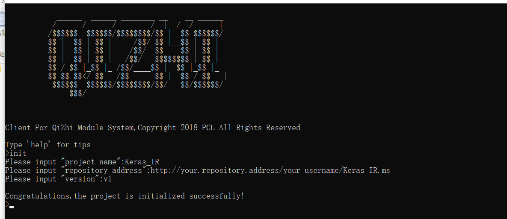

# 模块客户端

启智模块系统客户端

# 一. 如何编译？

安装依赖: `yarn .`  [yarn](https://yarnpkg.com/en)

编译: `pkg ms_client.js` [pkg](https://github.com/zeit/pkg#readme)

这样会编译出 windows ,mac,linux  三个OS 对应的版本。


# 二. 如何初始化一个项目

假如您想建立一个名字为`Keras_IR`的项目, 可以使用客户端的`init`命令.
过程如下图所示：



这样将会在本地初始化一个空项目，项目的根目录是`Keras_IR`,在`Keras_IR`目录下有
一个`.ms` 目录和一个`project.json` 文件。

`.ms` 目录放置该项目的其他版本，`project.json`里面是项目的信息,如下所示:

```js
{
  "name": "Keras_IR",//项目名称
  "remote": "http://192.168.113.221:6024/your_username/Keras_IR.ms",//远程地址
  "current": "v1",//当前版本号
  "versions": [ //版本历史
    "v1",
    "v2"
  ]
}

```
远程地址的格式为`protocol://host/username/project_name.ms` 。`host`是协议(`http`或者`https`),`host`是仓库的地址，可以是域名或者IP地址加端口号,`username`是您在该仓库的用户名，`project_name` 是您项目的名称.

`versions`是存放的历史版本号，默认数据最后面的是最迟创建的


# 三. 可用的命令

* `exit` 退出命令行工具
* `lang` 切换系统语言
* `login` 登陆远程仓库
* `clone` 从远程克隆一个项目
* `pull` 从远程拉取更新
* `push` 将本地更新到远程
* `init` 在本地初始化一个项目
* `convert` 在远程转换数据格式
* `version` 项目版本相关的操作


可以运行`help` 命令查看所有的命令列表，运行 `help 'command'` 查看指定命令的用法，

比如： `help version`:


# 四. 模型转换参数说明

命令: `convert -p your_config_file`

> 配置文件是 `.yaml` 格式

以下是各模型间转换的配置文件参数说明：

#### 4.1 IR 转 MXNet

```yaml
input_shape: ""

source_framework: "IR"

destination_framework: "MXNet"

#proto file (.pb 文件)的相对路径，相对于您项目的根目录
proto_file: ""  

# param file(.npy 文件) 的相对路径，相对于您项目的根目录
param_file: ""

```

#### 4.2 IR 转 PyTorch

```yaml
input_shape: ""

source_framework: "IR"

destination_framework: "PyTorch"

#proto file (.pb 文件)的相对路径，相对于您项目的根目录
proto_file: ""  

# param file(.npy 文件) 的相对路径，相对于您项目的根目录
param_file: ""

```

#### 4.3 MXNet 转 IR

```yaml
input_shape: ""

source_framework: "MXNet"

destination_framework: "IR"

#json file (.json 文件)的相对路径，相对于您项目的根目录
json_file: ""  

# param file(.params 文件) 的相对路径，相对于您项目的根目录
param_file: ""

```

#### 4.4 Keras 转  IR

```yaml
input_shape: ""

source_framework: "Keras"

destination_framework: "IR"

#json file （.json文件）的相对路径，相对于您项目的根目录
json_file: "" 

# model file (.h5文件)的相对路径，相对于您项目的根目录
model_file: ""

```

#### 4.5 PyTorch 转  IR

```yaml
input_shape: ""

source_framework: "PyTorch"

destination_framework: "IR"

# model file (.pth文件)的相对路径，相对于您项目的根目录
model_file: ""

```

# 五. 设计与代码结构

见  [design.md](./design.md)