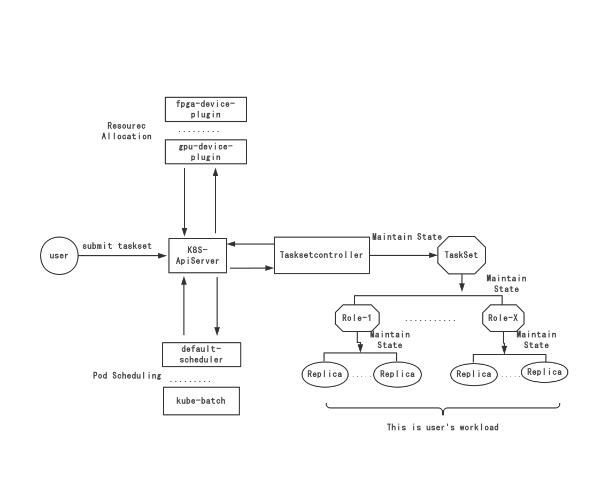

# TaskSetController

TaskSetController提供一个灵活的任务运行模型,用来应对ML/DL算法训练中多变的业务场景。

>早期，我们是[frameworkcontroller](https://github.com/microsoft/frameworkcontroller)的用户，后来因为自身业务需要不得不做一些定制，因此诞生了
这个项目，非常感谢[frameworkcontroller](https://github.com/microsoft/frameworkcontroller)！

## 一. 组件关联关系



用户提交任务到 __ApiServer__, __TaskSetController__ 从 __Api-Server__ 获悉用户提交的任务，负责驱动任务朝期望的状态变更(等待，运行中，完成（成功或者失败）)。

__TaskSetController__ 不负责分配[Pod](https://kubernetes.io/zh/docs/concepts/workloads/pods/)到具体的计算节点,用户可以自主选择底层的调度器，在上图中列出的default-scheduler和[kube-batch](https://github.com/kubernetes-sigs/kube-batch)就是可选的调度器，当然社区还有其他调度器可选。

fpga-device-plugin和[gpu-device-plugin](https://github.com/NVIDIA/k8s-device-plugin)这类角色则负责为任务分配特别的计算资源。


## 二. 快速创建一个任务

以tensorflow中常见的ps-worker场景为例：

```yaml
apiVersion: octopus.openi.pcl.cn/v1alpha1
kind: TaskSet
metadata:
  name: tensorflowdemo
spec:
  retryPolicy:
    retry: false
    maxRetryCount: 1
  roles:
    - name: ps
      replicas: 1
      completionPolicy:
        maxFailed: 1
        minSucceeded: 1
      retryPolicy:
        retry: false
        maxRetryCount: 1
      template:
        spec:
          restartPolicy: Never
          containers:
            - name: worker
              image: busybox
              command: ["sh","-c","sleep 100;exit 0"]
    - name: worker
      replicas: 3
      eventPolicy: 
        - event: RoleSucceeded
          action: TaskSetSucceeded
      completionPolicy:
        maxFailed: 2
        minSucceeded: 2
      retryPolicy:
        retry: true
        maxRetryCount: 2
      template:
        spec:
          restartPolicy: Never
          containers:
            - name: worker
              image: busybox
              command: ["sh","-c","sleep 30;exit 0"]
              resources:
                limits:
                    nvidia.com/gpu: 1
```
执行 `kubectl create -f taskset.yaml`提交任务到k8s.


## 三. 文档

* [部署文档](./docs/HOW_TO.md)
* [使用文档](./docs/USER_MANUAL.md)
* [日志文档](./docs/LOG.md)
* [PodDiscovery](./pkg/poddiscovery/readme.md)


