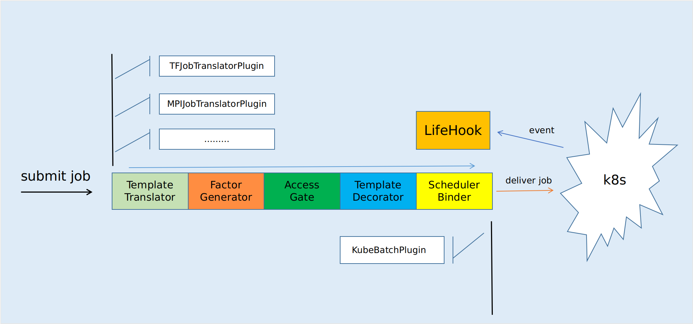

# Pipeline 文档

# 内容目录

* [要解决的问题](#head)
* [Pipeline的主业务流程](#c1)
    * [TemplateTranslator](#c11)
    * [FactorGenerator](#c12)
    * [AccessGate](#c13)
    * [TemplateDecorator](#c14)
    * [SchedulerBinder](#c15)
    * [LifeHook](#c16)
* [Pipeline上的Feature与Plugin](#c2)
    * [Feature & Plugin定义](#c20)
    * [jobSelector](#c21)
    * [各plugin的输入与输出](#c22)
        * [TemplateTranslator插件](#c221)
        * [FactorGenerator插件](#c222)
        * [AccessGate插件](#c223)
        * [TemplateDecorator插件](#c224)
        * [SchedulerBinder插件](#c225)
        * [LifeHook插件](#c226)
* [API目录](#c3)
    * [Feature和Plugin](#c31)
        * [注册feature](#c311)
        * [删除feature](#c312)
        * [禁用feature](#c313)
        * [启用feature](#c314)
        * [调整plugin执行顺序](#c315)
        * [查询plugin](#c316)
        * [获取plugin列表](#c317)
        * [获取feature列表](#318)
        * [查询feature](#319)
    * [任务操操作](#c32)
        * [提交任务](#c321)
        * [停止任务](#c322)
        * [唤起任务](#c324)
        * [查询任务配置](#c325)
        * [查询任务的TaskSet](#c326)
        * [查询任务详情](#c327)
        * [查询任务列表](#c329)
        * [查询任务数量](#c3210)
    * [权限管理](#c33)
        * [修改管理员密码](#c332)
        * [创建访问ID](#c333)
        * [修改访问ID权限](#c334)
        * [删除访问ID](#c335)
    * [code列表](#c34)

# <a name="head">要解决的问题</a>
### 1 ) 如何做到增加新的场景时只需关注该场景需求，不改动其他项目，做到场景独立？
 
答：只需在`TemplateTranslator`处声明对应场景的运行时，并注册转译的plugin；如果还需要一些准备工作，则可以在`TemplateDecorator`处添加。

### 2 )  这些已知的、未知的附加策略如何做到灵活加减？
 
答：通过向Pipeline注册增加策略，也可以从Pipeline禁用一些策略，用户可以随意组合。

### 3 )  社区以何种形式贡献代码呢？直接在一个庞大的项目里面改吗？

答：不用在一个项目里面改，社区贡献者可以用自己喜欢的语言，顺手的技术栈开发独立的策略，按Pipeline的接口规范接入即可。开发新策略简单，用别人贡献的策略也简单。


## <a name="c1">一.Pipeline的主业务流程</a>




Pipeline将任务的提交过程划分成５个阶段：

* 模板转译
* 因子生成
* 通行闸门
* 模板修饰
* 调度器绑定

这个五个阶段按顺序执行，开发者可以在每个阶段定义自己的处理逻辑，我们称之为Plugin。除此之外Pipeline还提供一个LifeHook功能，用户可在此订阅任务的生命周期事件。

通过这五个阶段的plugin加上LifeHook可以支撑用户定义丰富的扩展，能很好的解决前面提到的问题。


### <a name="c11">1 ) 　模板转译---TemplateTranslator</a>

用户可以编写各种场景的任务模板，比如kubeflow的`TFJob`,在模板转译阶段，由对应的Plugin转译成`TaskSet`。

所以模板转译完成用户任务模板到`TaskSet`的转译。


### <a name="c12">２)　因子生成---FactorGenerator</a>

由于业务需要，会根据不同策略产生一些影响任务运行的因子，比如从不同维度评价一个任务的优先级。

这个场景的特点是产生因子的策略相互独立，对同一个主题各自提出自己的意见，在之后会有一个角色聚合这个意见。

实际场景例子-->任务优先级：

* 根据用户等级产生任务优先级
* 根据任务特点产生任务优先级
* 根据用户历史任务优良情况产生任务优先级

上面三个维度各自对应一个`FactorGenerator`,主题是`priority`,各自的提议是:

* `{"topic":"priority","advice":"10","reason":"user is admin"}`
* `{"topic":"priority","advice":"4","reason":"this is a small task"}`
* `{"topic":"priority","advice":"1","reason":"The history job is terrible"}`

`SchedulerBinder`在绑定调度器时　就需要聚合上面各个维度的优先级，加权之后转译成对应调度器识别的形式。

Pipeline限定提出的因子需要有`topic`、`advice`、`reason`　三个字段。但是Pipeline并不限定可选的`topic`,也不限定`advice`的格式。

>不确定的输入必然导致使用困难。在系统上集成一种因子，意外着会使用这种因子，也即意味着会有一个消费者，所以应该由消费者
自己决定自己感兴趣的因子，对不符合条件的则忽略掉。

>对于不同来源，不同格式的因子，系统集成者应该负责统一格式。

### <a name="c13">3 ) 通行闸门---AccessGate </a>

根据一定的规则检查一个任务，并做出一个决定，这里规定只能做出三种决定：

* `pass`  检查通过，流程继续
* `suspend`　暂时不通过，可被唤醒，流程暂停
* `stop`  检查不通过，不可被唤醒，流程终止

多个[AccessGatePlugin](#c223)之间串行执行。

### <a name="c14">４） 模板修饰---TemplateDecorator</a>

修饰器允许对任务yaml模板做修饰，但只允许做增量的修改，不同修饰器之间的修饰结果不得有冲突。

>对command字段的增量操作有特殊支持，只允许在当前command前增加command，不允许覆盖。

不允许修改pod的`schedulerName`


### <a name="c15">５）调度器绑定---SchedulerBinder</a> 

允许对任务模板做增量修改。

每个任务只能匹配唯一的`SchedulerBinderPlugin`，默认使用k8s提供的默认调度器。

### <a name="c16">6 ) 生命周期钩子---Lifehook</a> 

任务生命周期中存在多个状态，Waiting、Running、Completed、Failed、Succeeded、Stopped，在出现特定状态变更时，需要做一些操作，比如在任务结束时就可以进行该任务的统计工作。那么需要主动告知关心这些事件的服务。

这个部分提供对任务生命周期的hook功能，其他服务可以主动订阅事件。


## <a name="c2">二.Pipeline上的Feature和Plugin</a>

### <a name="c20">Feature　＆　Plugin定义</a>

Pipeline的6个部分均可以绑定0个或者多个`Plugin`，这些Plugin以独立服务的形式存在,或者存在于一个服务中。


多个`Plugin`合在一起可以提供一个完整的`Feature`,单独的`Plugin`也可能是一个`Feature`。服务可以以`Feature`为粒度来进行划分，
不过具体还是应该实际的场景。

`Plugin`不能单独注册到Pipeline,需要以`Feature`为单位进行注册，Pipeline也以`Feature`为粒度来进行统一管理。

 
### <a name="c21">2.1　JobSelector定义</a>

Plugin通过[JobSelector](./selector.md)声明自己感兴趣的job,Pipeline只会将Plugin感兴趣的job提交给Plugin处理。

　
`jobSelector`例子：
```json
{
    "conditions":[
        {
            "name":"type",　//该条件的名称
            "key":"type",
            "expect":"debug" 
        },
        {
            "name":"user",
            "key":"user_role",
            "expect":"/admin|master/" 
        },
        ...
    ],
    "expression":"type && !user"
}
```

等价于:`type =="debug" && false == /admin|master/.test(user_role)`

`conditions`　部分声明独立的条件;

每个独立的条件包含`name`、`key`、`expect`三个部分,name是该条件的名字,
key是测试的键值（用户提交的任务的info部分，请参考API中任务提交部分的参数定义）,expect即期望的值。

>预置条件`userID`、`jobName`、`jobID`和`jobKind`可以直接使用，`jobKind`表示任务运行时模型类型。

`expect`为正则表达式正则表达式

`expression`是一个布尔表达式，支持　`&&`、`||`、`()`、`!`四种操作符，该表达式若为`true`则表示该jobSelector命中。

 ### <a name="c22">2.2 Plugin数据接口</a>

Plugin由Pipeline负责调用，Plugin与Pipeline的交互的数据格式为JSON。除lifehook外，Pipeline调用Plugin时输入的数据格式如下:

```json
{
    "factors":{

    },
    "header":{

    },
    "job":{}
}
```

`factors`为`FactorGenerator`类型Plugin产生的因子，格式如下:
```json
{
    "topic1":[{
            "topic":"topic1",
            "advice":"",
            "reason":""
        },{
            "topic":"topic1",
            "advice":"",
            "reason":""
        }
    ],
    "topic2":[
        {
            "topic":"topic2",
            "advice":"",
            "reason":""
        }
    ]
}
```
`header`为该任务的头信息:
```json
{
    "userID":"",//默认信息，用户ID
    "jobName":"",//默认信息，任务名
    "jobKind":"",//默认信息，任务类型
    "jobID":"",//默认信息，任务ID
    ....//其他附加信息
}
```

`job`为用户提交的任务，必须有`kind`字段,即格式为:

```json
{
    "kind":"",
    ...//其他
}
```
`kind`字段的值应与header里的`jobKind`字段值一致。job的其他内容及其格式由该任务类型决定，
但一旦经由`TemplateTranslator`类型Plugin转译之后，job的内容就应该符合TaskSet的定义。

也就是说`TemplateTranslator`类型Plugin接收到的job内容格式取决于其任务类型，其他Plugin收到都是转译后的TaskSet类型。

>转译之后，job内的kind字段的值变成了`TaskSet`,但header的`jobKind`值保持不变，即仍为原始的任务类型。

<a name="c221">１）　__TemplateTranslator插件__</a>


输出: 任务转译后的JSON格式的`TaskSet`.

Plugin之间关系: 各plugin之间互斥，该部分最多只能匹配一个Plugin。


<a name="c222">２ ) __FactorGenerator插件__</a>

　
输出:

```json
{
    "topic":"",//string　主题
    "advice":"",//string 建议
    "reason":"",//string 理由
}
```

plugin之间关系：相互独立，地位等价，一个任务可匹配多个。


<a name="c223">３） __AccessGate插件__</a>

输出:

```json
{
    "decision":"",//string
    "reason":"",//string,理由
}
```
`decision`是`AccessGate`类型Plugin做的决定，只有三种决定:

* `pass`　通过检查,继续流程
* `suspend` 暂时未通过检查，挂起，流程暂停，但后续可被唤醒
* `stop` 检查未通过，流程终止，不可被唤醒

`reason`是做出这个决定的理由


plugin之间的关系: 串行执行。


<a name="c224">４） __TemplateDecorator插件__</a>
 
输出: 修饰后的TaskSet. (JSON格式)

plugin之间关系：相互独立，地位平等，操作互不影响.


<a name="c225">5 ) __SchedulerBinder插件__</a>

 
输出：绑定调度器后的TaskSet. (JSON格式)

 

plugin之间关系：互斥，只能唯一匹配一个,默认使用k8s提供的默认调度器。

<a name="c226">6 ) __Lifehook插件__</a>

输入：

```json
｛
    "id":"",
    "current_state":""
｝
```

* `id` 任务的id
* `current_state` 当前状态

状态列表:

* `waiting`
* `running`
* `failed`
* `succeeded`
* `stopped`

Life-Hook的jobSelector多一个选择项.

```json
{
    "conditions":[
        {
            "name":"type",　//该条件的名称
            "key":"type",
            "expect":"debug" //字符串
        },
        {
            "name":"user",
            "key":"user_role",
            "expect":"/admin|master/" //正则式
        },
        ...
    ],
    "expression":"type && !user",
    "states":[] //感兴趣的状态列表
}
```

感兴趣的状态列表可选一个或者多个状态，当任务状态变更到感兴趣的状态时就会通知对应的订阅者。
可用`["*"]`表示所有状态，空数组无效。

`Life-Hook响应ACK`，
订阅者在收到通知后，需要按Life-Hook的ACK标准响应内容，以此Life-Hook来做出响应的处理，响应标准如下：
- http状态响应码200
- 响应body为：OK|RE|EX //OK:成功，RE:重试,EX:异常
- 响应头Content-Type: text/plain


## <a name="c3">三.API</a>

### <a name="c31">3.1 Feature和Plugin操作相关API</a>

<a name="c311">__１）　注册Feature__</a>

协议: HTTP

方法: POST

地址: `/v1/features`

参数:

```json
{
    "jobSelector":{//全局默认JobSelector
        "conditions":[],
        "expression":"",
    },
    "plugins":[//该feature的plugin列表
        {
            "pluginType":"",//该plugin的类型
            "callAddress":"",//该plugin的回调地址
            "description":"",
            "jobSelector":{//局部JobSelector
                "conditions":[],
                "expression":""
            }
        },
        ...
    ],
    "name":"",//该feature的名称
    "author":"",//作者
    "description":"",//
}
```

局部的jobSelector可以使用全局jobSelector定义的条件，也可以在局部覆盖全局定义的条件；
局部的jobSelector如果未声明expression，则使用全局默认的expression。
如果局部的plugin没有声明jobSelector，则默认使用全局的jobSelector。


`pluginType`为plugin类型,支持的类型有:

* `TemplateTranslator`
* `FactorGenerator`
* `AccessGate`
* `TemplateDecorator`
* `SchedulerBinder`
* `LifeHook`

返回：

```json
{
    "code":"",//状态码
    "msg":"",//附加说明
}
```

> 新注册的feature默认不启用


<a name="c312">__2 ) 删除Feature__</a>

协议: HTTP

方法: DELETE

地址: `/v1/features/{feature_name}`

返回:
```json
{
    "code":"",
    "msg":""
}
```

<a name="c313">__3 ) 禁用Feature__</a>

协议: HTTP

方法: PUT

地址: `/v1/features/turn-off/{feature_name}`

返回:
```json
{
    "code":"",
    "msg":""
}
```

<a name="c314">__4 ) 启用Feature__</a>

协议: HTTP

方法: PUT

地址: `/v1/features/turn-on/{feature_name}`

返回:
```json
{
    "code":"",
    "msg":""
}
```

<a name="c315">__5 ) 调整Plugin执行顺序__</a>


协议: HTTP

方法: PUT

地址: `/v1/plugins/sequence`

参数(格式： json):

```json
{
    "beforeKey":"",//调整后在前执行的plugin
    "afterKey":"", //调整后在后面执行的plugin
    "pluginType":"" //plugin的类型
}
```

返回:
```json
{
    "code":"",
    "msg":""
}
```

<a name="c316">6 ) __查询plugin__</a>

协议: HTTP

方法: GET

地址: `/v1/plugins/detail/{plugin_name}`

返回:
```json
{
    "code":"",
    "msg":"",
    "payload":{
        "key":"",
        "pluginType":"",
        "callAddress":"",
        "description":"",
        "jobSelector":{},
        "sequence":""
    }
}
```

<a name="c317">7 ) __获取plugin列表__</a>

协议： HTTP

方法: GET

地址: `/v1/plugins/list/{type}`

返回:

```json
{
    "code":"",
    "msg":"",
    "payload":[
        {
             "key":"",
             "pluginType":"",
             "callAddress":"",
             "description":"",
             "jobSelector":{},
             "sequence":""
        },
        ...
    ]
}
```

<a name="c318">8 ) __获取Feature列表__</a>

协议: HTTP

方法: GET

地址: `/v1/features/list/{author}`

返回:

```json
{
    "code":"",
    "msg":"",
    "payload":[
        {
            "name":"",
            "author":"",
            "description":"",
            "enabled":"",
            "authorization":"",
            "jobSelector":{
                "conditions":[],
                "expression":"",
            },
            "plugins":[],
        },
        ...
    ]
}
```
> author为all时表示所有用户

<a name="c319">9 ) __获取Feature__</a>

协议: HTTP

方法: GET

地址: `/v1/features/detail/{name}`

返回:

```json
{
    "code":"",
    "msg":"",
    "payload":{
        "name":"",
        "author":"",
        "description":"",
        "enabled":"",
        "authorization":"",
        "jobSelector":{
            "conditions":[],
            "expression":"",
        },
        "plugins":[],
    }
}
```


### <a id="c32">3.2 任务相关</a>

<a name="c321">__1 ) 提交任务__</a>

协议: HTTP

方法: POST

地址: `/v1/job`

参数:

```json
{
    "userID":"",// 用户id
    "jobName":"",// 任务名
    "jobKind":"",// 任务类型
    "header":{}, //任务附带信息
    "job":{//任务的配置信息，即运行模板
        "apiVersion":"",//job对应的api版本
        "kind":"",//job类型
        ...　//其他设置
    }
}
```

返回:

```json
{
    "code":"",
    "msg":"",
    "payload":{
        "jobID":"",//生成的任务ID
    }
}
```


<a name="c322">__２ ) 停止任务__</a>

协议: HTTP

方法: PUT

地址: `/v1/job/stop/{jobID}`

参数: 
```json
{
    "jobID":"",//任务id
    "reason":"",//停止任务的理由
}
```

返回:
```json
{
    "code":"",
    "msg":"",
}
```
 

<a name="c324">__3) 唤起任务__</a>

协议: HTTP

方法: PUT

地址: `/v1/job/resume/{jobID}`

参数: 
```json
{
    "jobID":"",//任务id
    "reason":"",//停止任务的理由
}
```

返回:
```json
{
    "code":"",
    "msg":"",
}
```
>　`checker`可以让一个任务暂时挂起，调用这个API可以让流程恢复，恢复之后继续走下一个没有执行过的流程。

<a name="c325">__4 ) 查询任务配置__</a>

> 任务的配置信息，即提交时参数的job部分

协议: HTTP

方法: GET

地址: `/v1/job/config/{jobID}`

返回:

```json
{
    "code":"",
    "msg":"",
    "payload": {} //原始任务的配置信息，即提交时参数的job部分
}
``` 
<a name="c326">__5 ) 查询任务对应的TaskSet__</a>

>用户提交的任务最终都会被转译成TaskSet，在提交到k8s,该api返回任务转译后的TaskSet信息

协议: HTTP

方法: GET

地址: `/v1/job/taskset/{jobID}`

返回:

```json
{
    "code":"",
    "msg":"",
    "payload": {} //taskset信息
    
}
``` 
<a name="c327">__6 ) 查询任务详情__</a>

>　查询任务详情

协议: HTTP

方法: GET

地址: `/v1/job/detail/{jobID}`

返回:

```json
{
    "code":"",
    "msg":"",
    "payload":{
         "version":"v1",//数据格式版本号
         "job":{
             "id":"",//任务id
             "name":"",//任务名
             "type":"",//任务类型
             "state":"",//任务状态
             "userID":"",//任务所属用户id
             "startAt":"",//任务开始时间
             "finishedAt":"",//任务结束时间
             "totalRetriedCount":"",//任务重试次数
             "exitCode":"",//任务退出时的code
             "exitDiagnostics":""//任务退出时的信息
         },
         "cluster":{//任务对应的集群信息，暂时未设置
             "identity":"",
         },
         "tasks":[//子任务列表
             {
                 "name":"",//子任务名
                 "image":"",//子任务对应的容器
                 "state":"",//子任务状态
                 "command":"",//子任务的启动命令
                 "replicaAmount":"",//子任务副本数
                 "maxFailedTaskCount":"",//子任务最多能失败的副本数量
                 "minSucceededTaskCount":"",//子任务最少要成功的副本数量
                 "resource":"",//使用的资源
                 "replicas":[
                     {
                         "index":"",//副本编号
                         "state":"",//副本状态
                         "retriedCount":"",//副本重试次数
                         "startAt":"",//副本启动时间
                         "finishedAt":"",//副本结束时间
                         "containerID":"",//容器ID
                         "containerHostIP":"",//容器所在机器的IP
                         "exitCode":"",//容器退出的code
                         "exitDiagnostics":""//容器退出时的信息
                     }
                     ...
                 ]
             }
             ...
         ],
         "platformSpecificInfo":{
             "platform":"k8s",
             "apiVersion":"",//CRD的apiVersion
             "namespace":"",
             "instanceUID":"",
             "configMapUID":"",
             "configMapName":"",
             "taskRuntimeInfo":[
                 {
                     "name":"",
                     "nodeSelector":{},
                     "replicas":[
                         {
                             "index":"",
                             "podIP":"",
                             "podUID":"",
                             "podName":"",
                             "podHostIP":"",
                             "podReason":""
                         },
                         ...
                     ],
                     "volumeMounts":[]//corev1.Volume
                 }
             ]
         }
    }
}
``` 
 
<a name="c329">__7 ) 查询任务列表__</a>

协议: HTTP

方法: GET

地址: `/v1/job/list?${parameters}`

查询参数可选:

* `userID` 用户ID
* `startAt` 查询开始时间,数字类型，单位秒
* `endAt` 查询结束时间,数字类型，单位秒
* `kind`　任务类型
* `pageNumber` 数据页号
* `pageSize` 数据每页数量
* `order` desc 或者　asc按开始时间升序或者降序
* `state`　任务状态

> startAt 和 endAt 是查询任务提交时间在这个区间的数据

返回:

```json
{
    "code":"",
    "msg":"",
    "payload":[
        {
            "jobID":"",
            "jobName":"",
            "jobKind":"",
            "userID":"",
            "state":"",
            "createdAt":"",
            "finishedAt":""
        },
        ...
    ]
}
```

<a name="c3210">__8 ) 查询任务数量__</a>

协议: HTTP

方法: GET

地址: `/v1/job/count?${parameters}`

查询参数可选:

* `userID` 用户ID
* `startAt` 查询开始时间,数字类型，单位秒
* `endAt` 查询结束时间,数字类型，单位秒
* `kind`　任务类型
* `state`　任务状态

> startAt 和 endAt 是查询任务提交时间在这个区间的数据

返回:

```json
{
    "code":"",
    "msg":"",
    "payload": {
        "count":0,// 任务数量
    }
}
```

### <a name="c33">3.3 权限管理</a>

权限分类：

* `write-job` 提交、修改任务的权限
* `read-job` 任务查询权限
* `register-plugin` 注册plugin的权限
* `write-plugin` plugin开关、删除、调整权限
* `read-plugin` plugin　读取权限
* `admin` 超级权限 


>系统只用一个admin用户，默认密码`admin`。

<a name="c332">__1 ) 修改管理员密码__</a>

协议: HTTP

方法: PUT

地址: `/v1/tokens/admin`

参数:
```json
{
    "token":""//new password
}
```

返回:
```json
{
    "code":"",
    "msg":"",
}
```

<a name="c333">__2 )　创建新的访问ID__</a>

> 访问ID是24位随机字符串，是访问core的凭证

协议: HTTP

方法: POST

地址: `/v1/tokens`

参数:
```json
{
    "privileges":[],// 权限列表,至少得有一项,
    "forwho":"",//为谁创建
    "note":""//备注信息
}
```

返回:

```json
{
    "code":"",
    "msg":"",
    "payload":{
        "token":""
    }
}
```

可选的权限列表:

* `read_job` 任务的读取权限
* `write_job` 任务的写权限
* `read_feature` feature的读权限
* `write_feature` feature的写权限
* `read_token` token的读权限
* `write_token` token的写权限

<a name="c334">__3 ) 修改访问ID的权限__</a>

协议: HTTP

方法: PUT

地址: `/v1/tokens/normal`

参数：

```json
{
    "token":"",//目标token
    "privileges":[]// 新的权限列表
}
```

返回:
```json
{
    "code":"",
    "msg":"",
}
```

可选的权限列表:

* `read_job` 任务的读取权限
* `write_job` 任务的写权限
* `read_feature` feature的读权限
* `write_feature` feature的写权限
* `read_token` token的读权限
* `write_token` token的写权限

<a name="c335">__4 ) 删除访问ID__</a>

协议: HTTP

方法: DELETE

地址: `/v1/tokens`

参数:
```json
{
    "token":""
}
```

返回:

```json
{
    "code":"",
    "msg":""
}
```

### <a id="c34">3.4 code列表</a>

| CODE| 含义|
|---|---|
|`OPERATION_SUCCEEDED` | 操作成功| 
|`LACK_OF_PARAM` | 参数不足|
|`WRONG_PARAM` | 参数错误|
|`UNSUPPORTED_PLUGIN_TYPE` | 不支持plugin类型|
|`PERMISSION_DENIED`| 无操作权限|
|`OPERATION_TARGET_NOT_FOUND`| NOT FOUND ,操作目标不存在|
|`UNSUPPORTED_OPERATION`| 不支持的操作|
|`INTERNAL_ERROR`| 内部服务错误|
 